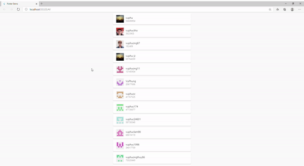

# flutter-base-structure

- **Build runner**

```shell
cd core
flutter packages pub run build_runner build --delete-conflicting-outputs
```

- **Run on web**

```shell
cd web_app
flutter run -d edge (chrome)
```



