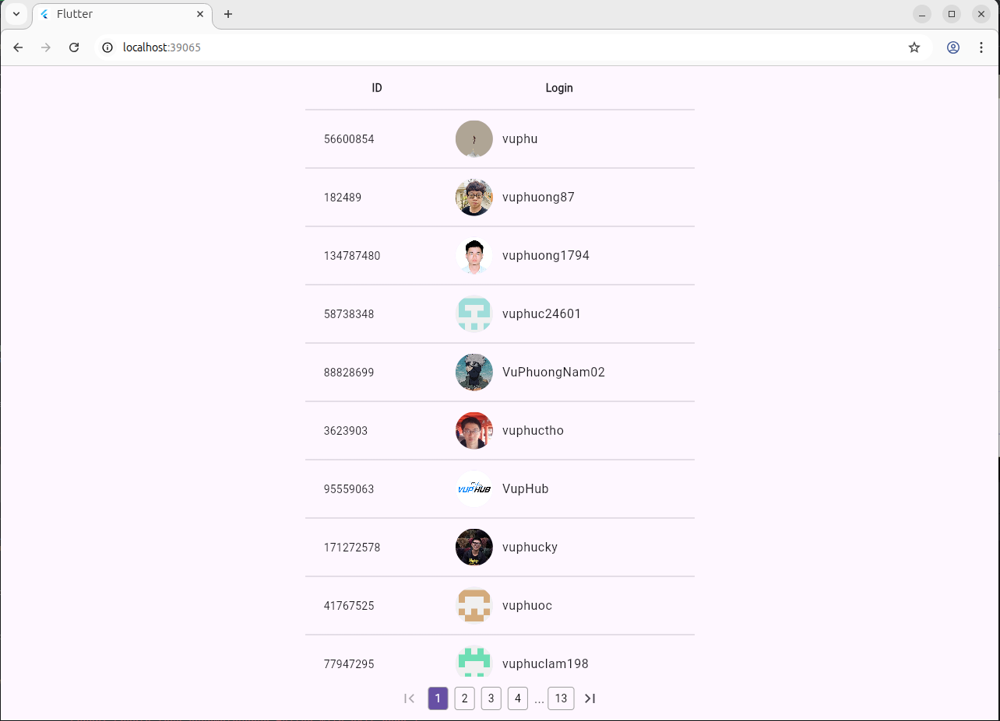

A Flutter base project with essential boilerplate code for development.

- **Install**
```shell
sh scripts/pub-get.sh
```

- **Build runner**

```shell
sh scripts/build-runner.sh
```

- **Run on web**

```shell
cd packages/web
flutter run -d edge (chrome)
```



